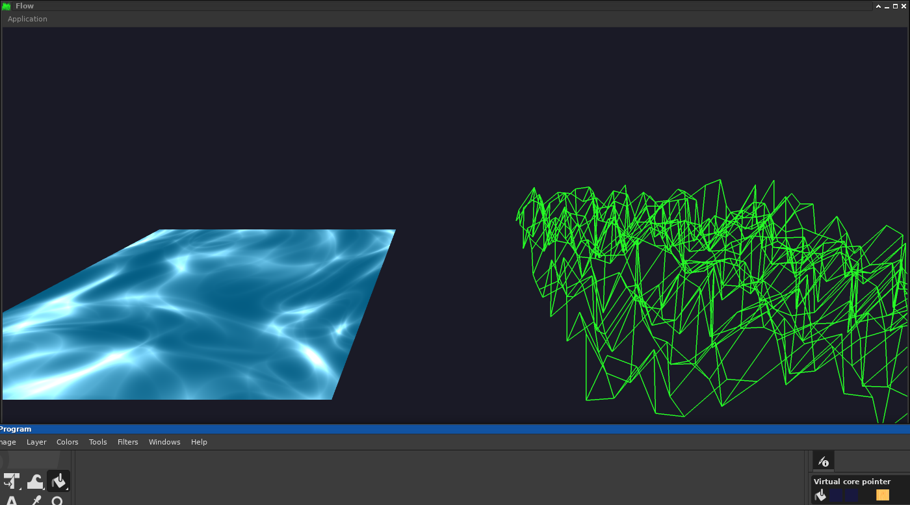

This is some shader experiment.

It may serve as a testbed to vary some shaders obtained from:
https://www.shadertoy.com/
The outline is :
1. place the shader source in res
4. the name for the function needs to be main (without parameters)
     ... the rest changes may vary but use e.g. waveshader.glsl vs. source as example
2. add the file-name in glsceneapp.grsources.xml
3. in GlPlaneView::init_shaders ~ line 75 replace the name for the fragment-shader
5. see how it works
6. again in GlPlaneView::draw ~ line 215
7.   ... at  UV res(1.0f, 1.0f) change the value to the nice scale
8.   ... at  float t = (float)((double)time/3.0E6);

