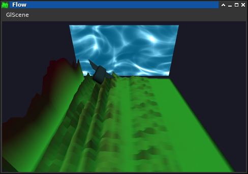

= GLscene =

To make this a bit more useful integrated a sound output capture,
with fft-conversion 
(but still this is more or less collection to test some 3d functions).

- basic build instructions with genericImg/genericGlm (required)
- requires Pulseaudio
- as the output levels may vary, use preferences to adjust display to taste
- the conversion of fft-data may not be to everyones taste (linear is prefered at the moment)

== Shader display ==

This may also be used for some shader experiment
(decide yourself if this is effect is worth the effort
  -> depends on how capable your graphics card is).

To vary the display other shaders obtained from:
https://www.shadertoy.com/
The outline is :
1. place the shader source in res
4. the name for the function needs to be main (without parameters)
     ... the rest changes may vary but use e.g. waveshader.glsl vs. source as example
2. add the file-name in glsceneapp.grsources.xml
3. in GlPlaneView::init_shaders ~ line 75 replace the name for the fragment-shader
5. see how it works
6. again in GlPlaneView::draw ~ line 215
7.   ... at  UV res(1.0f, 1.0f) change the value to a nice scale
8.   ... at  float t = (float)((double)time/3.0E6);

== Model display ==

The preference allow to load & animate some obj model.
Blender allows to create & edit such models and export them as obj.

=== Blender ===

- keep your model at a reasonable size for your available hardware. 

With blender the normals are not always correct to fix them use e.g. (in edit mode):
- mesh, normals, calculate outside
- mesh, shading smooth faces

To fix "non-uniform scale":
-  use object mode "Strg A" + Scale to apply
